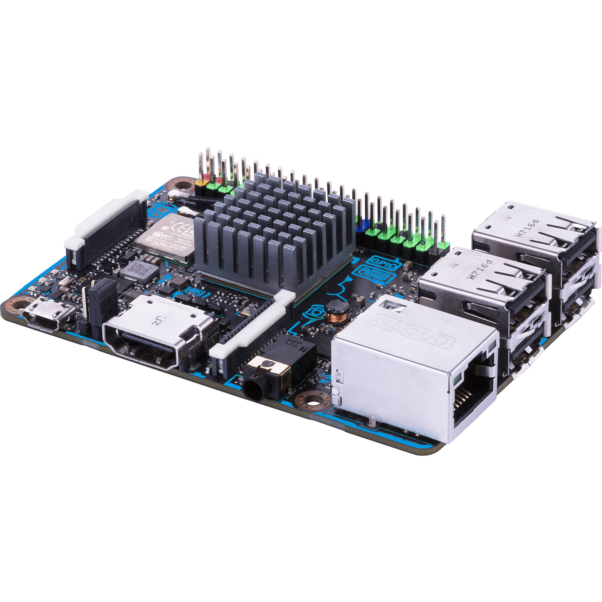
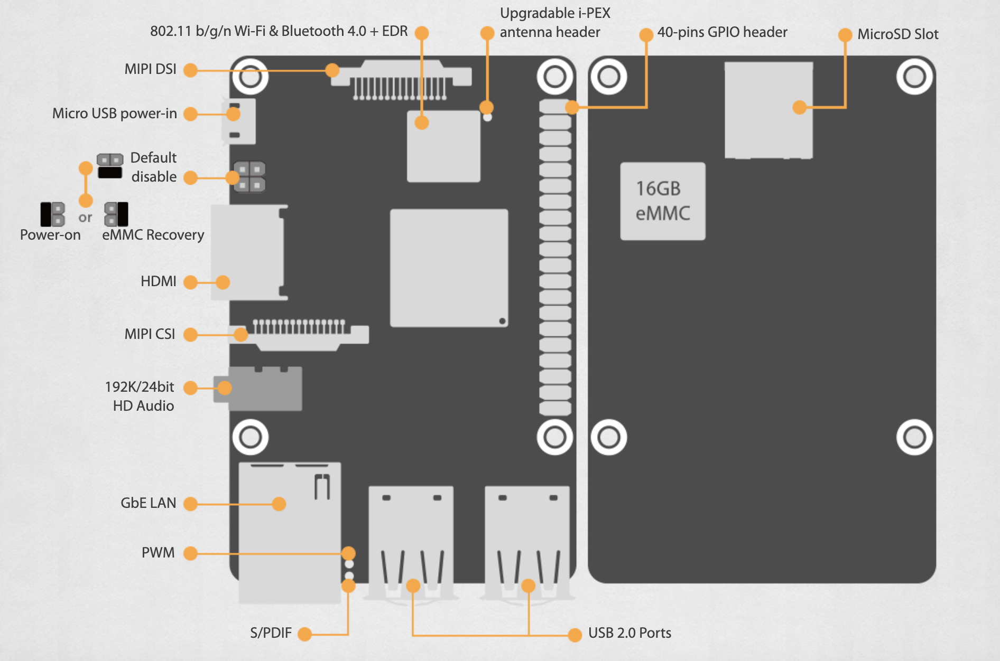

# ASUS Tinker Board S

## Features

Many see the [ASUS Tinker Board S ](https://www.asus.com/us/Single-Board-Computer/Tinker-Board-S/)as a premium Raspberry Pi. The Tinker Board s has an ARM-based processor the Rockchip RK3288, Tinker Board S offers significantly improved performance versus other popular SBC boards. The Tinker Board S features 2GB of LPDDR3 dual-channel memory and is equipped with an onboard 16GB eMMC and SD 3.0 interface that offer significantly faster read and write speeds for the OS. Tinker Board S has HDMI CEC hardware circuit implemented, with the supported software, other fixed functions include H.264 and H.265 playback support, as well as HD and UHD video playback. Tinker Board S also features Gbit LAN for Internet and network connectivity Tinker Board S features a 40-pin GPIO interface and enhanced I2S interface with Master and Slave modes for improved compatibility.

## Specifications

<table>
  <thead>
    <tr>
      <th style="text-align:left">Tinker Board S Specs</th>
      <th style="text-align:left"></th>
    </tr>
  </thead>
  <tbody>
    <tr>
      <td style="text-align:left">CPU</td>
      <td style="text-align:left">Rockchip Quad-Core RK3288 processor</td>
    </tr>
    <tr>
      <td style="text-align:left">Memory</td>
      <td style="text-align:left">2GB Dual Channel DDR3</td>
    </tr>
    <tr>
      <td style="text-align:left">Graphic</td>
      <td style="text-align:left">
        
Integrated Graphics Processor

        
ARM&#xAE; Mali&#x2122;-T764 GPU

      </td>
    </tr>
    <tr>
      <td style="text-align:left">Storage</td>
      <td style="text-align:left">16GB eMMC and Micro SD(TF) card slot</td>
    </tr>
    <tr>
      <td style="text-align:left">LAN</td>
      <td style="text-align:left">RTL GB LAN</td>
    </tr>
    <tr>
      <td style="text-align:left">Wireless Data Network</td>
      <td style="text-align:left">802.11 b/g/n, Bluetooth V4.0 + EDR</td>
    </tr>
    <tr>
      <td style="text-align:left">Audio</td>
      <td style="text-align:left">RTL ALC4040 CODEC</td>
    </tr>
    <tr>
      <td style="text-align:left">USB Ports</td>
      <td style="text-align:left">4 x USB 2.0</td>
    </tr>
    <tr>
      <td style="text-align:left">Internal I/O Ports</td>
      <td style="text-align:left"><b>1 x 40-pin header :</b>
         - up to 28 x GPIO pins
         - up to 2 x SPI bus
         - up to 2 x I2C bus
         - up to 4 x UART
         - up to 2 x PWM
         - up to 1 x PCM/I2S
         - 2 x 5V power pins
         - 2 x 3.3V power pins
         - 8 x ground pins
         <b>1 x 2-pin contact pin :</b>
         - 1 x PWM
         - 1 x S/PDIF
         <b>1 x 15-pin MIPI DSI</b>
         <b>1 x 15-pin MIPI CSI</b>
      </td>
    </tr>
    <tr>
      <td style="text-align:left">Form Factor</td>
      <td style="text-align:left">3.37 inch x 2.125 inch ( 8.55 cm x 5.4 cm )</td>
    </tr>
    <tr>
      <td style="text-align:left">Weight</td>
      <td style="text-align:left">55g</td>
    </tr>
  </tbody>
</table>#### Teams Contributed to this Article:

* [BLRS](https://purduesigbots.com/) \(Purdue SIGBots\)

