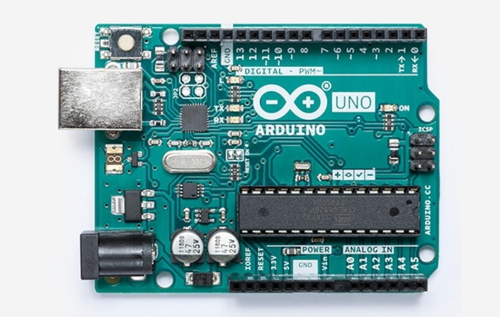

# Arduino

Featuring 5-volt operation and impressive [Output Drive](../output-drive.md), this microcontroller platform is not to be underestimated.

## Arduino Uno

| **Architecture:** 8-bit Atmel AVR |
| :--- |
| **Processor:** [ATmega328P](http://ww1.microchip.com/downloads/en/DeviceDoc/ATmega48A-PA-88A-PA-168A-PA-328-P-DS-DS40002061A.pdf) |
| **Languages:** C \([Arduino IDE](https://www.arduino.cc/en/main/software)\) |
| **Clock:** 16 MHz |
| **Vcore:** 5.0 V |
| **Vio:** 5.0 V |
| **Power:** 150 mW |
| **Flash:** 31 KB |
| **RAM:** 2 KB |
| **GPIO:** 14 \(of which 6 provide PWM output\) |
| **Peripherals:** 6x [Analog-Digital Converter](https://github.com/purduesigbots/BLRS-Wiki/tree/3aeb8702c5b3a6c01813fc864764d2c87eb47766/w/wiki/ee/adc/README.md) _\(5.0 V, 10-bit\)_ [UART](https://github.com/purduesigbots/BLRS-Wiki/tree/3aeb8702c5b3a6c01813fc864764d2c87eb47766/w/wiki/ee/uart/README.md), [SPI](https://github.com/purduesigbots/BLRS-Wiki/tree/3aeb8702c5b3a6c01813fc864764d2c87eb47766/w/wiki/ee/spi/README.md), [I2C](https://github.com/purduesigbots/BLRS-Wiki/tree/3aeb8702c5b3a6c01813fc864764d2c87eb47766/w/wiki/ee/i2c/README.md) |

As an evolution of the first Arduino boards \(first the Arduino USB, then the NG, next the Diecimila, the Duemilanove, and finally the Uno\), the **Arduino Uno** has been refined countless times while retaining good shield compatibility and a stable code base.

### Features

* Widely used; code examples are easy to find and comprehensive
* Form factor fits hundreds of [aftermarket shields](http://www.shieldlist.org/) which provide ready-made functionality
* Phenomenal 40 mA output drive \([Slew Rate](../slew-rate.md) is actually faster than the system clock!\)
* [Arduino IDE](https://www.arduino.cc/en/Main/Software) makes development relatively easy, and library is chunky but easy to use
* [Bootloader](https://github.com/Optiboot/optiboot) makes the impact of programming errors small and reprogramming easy over USB

### Shortcomings

* Low performance; performing [Object Recognition](../../../software/object-recognition/) on this device is out of the question
* Very little program memory or RAM available
* Peripheral set very limited; [general purpose I/O](../gpio.md) are scarce \(only one hardware [USART](../usart.md), [I2C](../i2c.md) takes over Analog inputs\)
* Since surpassed for high-performance usage by other, form-factor compatible platforms such as the [Netduino](arduino.md) and [LeafLabs Maple](leaflabs-maple.md)

### History

Getting used to programming on the confines of an Arduino steeps one's understanding with the [fundamentals of embedded program design](../../../software/general/embedded-programming-tips.md). SIGBots therefore recommends that newcomers to embedded systems programming \(particularly those on robot programming or electronics subteams\) take their first steps on an **Arduino Uno**. The comprehensive array of code samples also makes it a good choice for personal experimentation.

## Arduino Leonardo

| **Architecture:** 8-bit Atmel AVR |
| :--- |
| **Processor:** [ATmega32U4](http://arduino.cc/en/Main/ArduinoBoardLeonardo/) |
| **Languages:** C \([Arduino IDE](https://www.arduino.cc/en/main/software)\) |
| **Clock:** 16 MHz |
| **Vcore:** 5.0 V |
| **Vio:** 5.0 V |
| **Power:** 100 mW |
| **Flash:** 28 KB |
| **RAM:** 2 KB |
| **GPIO:** 23 |
| **Peripherals:**12x [Analog-Digital Converter](../analog-digital-converter.md) _\(5.0 V, 10-bit\)_ [UART](../uart.md), [SPI](../spi.md), [I2C](../i2c.md) |

## Arduino Mega

| **Architecture:** 8-bit Atmel AVR |
| :--- |
| **Processor:** [ATmega2560](http://arduino.cc/en/Main/ArduinoBoardMega2560/) |
| **Language:** C \([Arduino IDE](https://www.arduino.cc/en/main/software)\) |
| **Clock:** 16 MHz |
| **Vcore::** 5.0 V |
| **Vio:** 5.0 V |
| **Power:** 250 mW |
| **Flash:** 256 KB |
| **RAM:** 8 KB |
| **GPIO: 54** |
| **Peripherals:** 16x [Analog-Digital Converter](../analog-digital-converter.md) _\(5.0 V, 10-bit\)_, 4x [UART](../uart.md), [SPI](../spi.md), [I2C](../i2c.md) |

The **Arduino Mega** is an expanded version of the Arduino meant for memory or IO-hungry projects. It costs twice as much as a regular Arduino and is nearly two times larger, but fails to make significant progress in CPU power.

#### Teams Contributed to this Article:

* [BLRS](https://purduesigbots.com/) \(Purdue SIGBots\)

