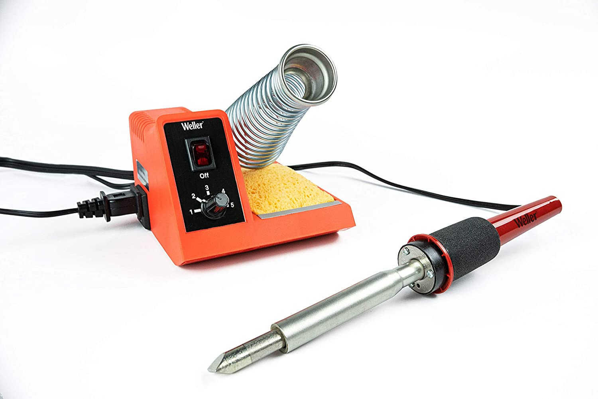
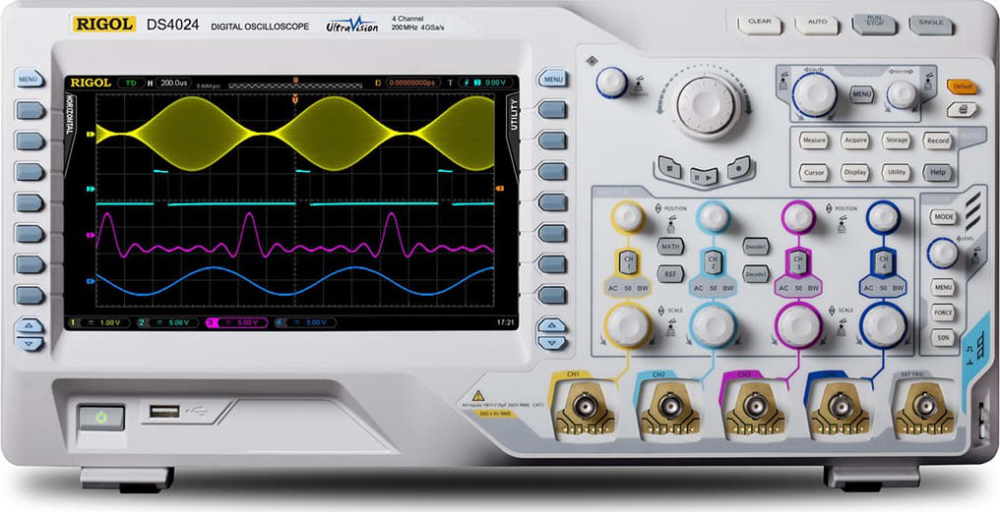

# List of Tools

## Digital multimeter

The **digital multimeter**, or **DMM** for short, is the typical method of measuring electrical attributes such as voltage, current, or resistance. Most low-cost DMMs have a dial which is used to select the measurement mode and the expected range of values to be read, while better meters might automatically determine the range. As DMMs are battery-powered, one must remember to turn them off after use. Purdue Engineering stocks precision benchtop DMMs in most electrical engineering labs for delicate tasks. Analog multimeters are also available, but are notoriously difficult to use.

DMMs only update at about 1 Hz and are ill-suited for measuring varying or periodic waveforms; an oscilloscope is more useful in that regard.

## Soldering iron

For permanent connection of electrical parts, soldering is the most common method. A **soldering iron** is the simplest way to heat up a joint to the melting point of the solder in use, which is usually much less than that of any other metal type in the circuit \(but sometimes hot enough to damage nonmetallic insulation\). Basic soldering irons have a low-wattage heating element and rely on thermal equilibrium between radiative losses to the environment and heat generation to achieve an unstable temperature reference, whereas better models measure the current temperature and use a [PID Controller](../software/control-algorithms/pid-controller.md) to improve accuracy.

Soldering irons should not be kept on a joint for longer than necessary, as many components can be damaged by excessive heat. As is usually expected, the tip is hot and can burn a person; do not pick up a soldering iron by the tip, _even when it is off_, as most soldering irons take a long time to cool after power is removed. **Clean the tip** using a wet sponge frequently _before, during, and after_ use; this is the _number one_ way to improve soldering! A clean tip is much easier to use than a dirty tip and makes higher quality joints.

Soldering irons can be used for many types of joints, but soldering a large circuit is a tiresome manual process which is prone to error. A reflow process can be used instead to solder all joints at the same time, particularly in the case of surface-mount components. Use of proper soldering technique is essential, along with external flux and the proper type of solder. Lead-free solder is notably more difficult to use properly than older leaded solder.

## Oscilloscope

An **oscilloscope** is an electronic device intended to measure high-frequency periodic changes in electrical circuits or to observe one-time occurrences. The input voltage is sampled rapidly, millions of times per second versus a few times per second by a digital multimeter, and the variation over time displayed on the oscilloscope screen. The iconic graph is updated whenever a user-defined "trigger" event occurs to avoid a scrolling waveform caused by an inability to lock onto a consistent point in the signal; alternatively, a single capture can be set to observe a transient phenomenon. Some oscilloscopes use a computer screen for output and allow the loading and saving of captured waveforms, known as "traces".

Oscilloscopes are invaluable for examining electronics circuits, but can only generally measure voltage. Usually, this is sufficient, as innovative measuring techniques can allow the indirect measurement of resistance, capacitance, or current by measuring some other part of the circuit under test. Do note that the negative lead of the oscilloscope is _usually grounded_; this will cause issues if measuring a circuit which is directly or indirectly connected at some point to the ground, either by using a "wall-wart" style outlet power supply or by being connected to a computer system \(which are always grounded\).

Older, analog oscilloscopes used a cathode ray tube to deflect an electron beam directly with the input voltage; this led to a large, heavy device that was not very portable. The latest digital oscilloscopes sample the input with an [Analog-Digital Converter](analog-digital-converter.md) and display the result on an LCD screen, making them cheaper and easier to use. A detailed explanation of oscilloscope terminology and use can be found on Wikipedia.

## Bus/logic analyzer

Advanced protocols can be difficult to debug, and oscilloscopes usually cannot monitor more than two or three channels at a time. A **logic analyzer** or bus analyzer can sample many digital signals at a very high speed \(often exceeding 100 MHz bandwidth\) to find and fix digital signal problems. Such devices are usually buffered and PC-based to allow custom triggering or decoding of protocol information into a user-readable format. 

The high speed and channel count comes at the cost of not recording the actual voltage \(only the _high_ or _low_ state\) problems with [Slew Rate](slew-rate.md) and [Line Noise](line-noise.md) must be found with a traditional oscilloscope.

