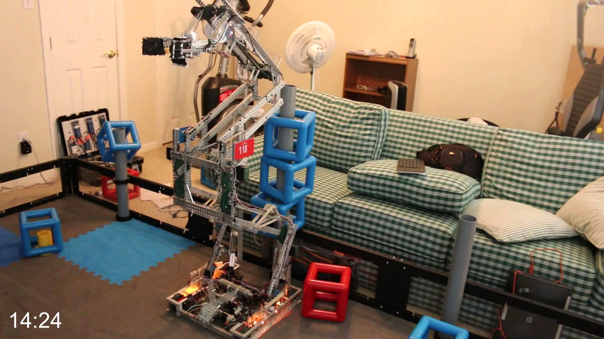

# Double Reverse Four Bar (DR4B)

The double reverse four bar lift is one of the more complicated lift designs used in Vex Robotics competitions. The lift is comprised of two iterations of a four bar lift. One iteration is mounted in the same manner as for a standard four bar lift. The second iteration is mounted at the end of the first iteration at the location where the intake or object manipulation mechanisms would normally be positioned. The second four bar lift faces the opposite direction as the first iteration. This allows the overall lift to rise almost completely vertically as opposed to a single four bar lift that rises forward and up simultaneously. This can be an advantage or disadvantage depending on the desired task. 

Double reverse four bar lifts keep the weight of a load centered over the base of the robot instead of lifting it up in front of the robot. This helps prevent the robot from tipping over. The double reverse four bar lift has a significant height advantage over a four bar lift without the lifting the load in front of the robot. The double reverse four bar lift design is much more complex than a four bar lift or a six bar lift and thus is more difficult and time consuming to build. Double reverse four bar lifts must be carefully constructed, coded, and maintained to ensure optimal functionality. They are more prone to breaking parts and motors than other lift designs.

## Consensus

These can be regarded as difficult, but they are much more stable, compact, and easy to maintain than other lifts that reach similar heights. This type of lift has been incredibly popular for both the Skyrise and ITZ seasons, and for good reason.

