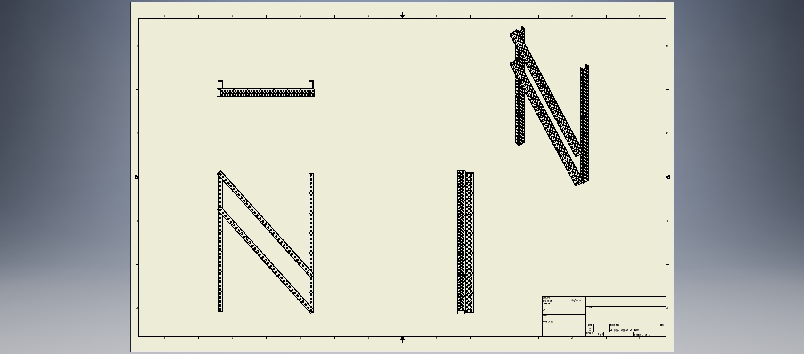

# Four Bar

The four bar lift is one of the most used lifts in Vex competitions due to its simplicity and ease of building. The four bar lift is constructed using two sets of parallel bars that move up and down in unison. Two sets of vertical bars line both the front and back so that the lift can be attached to a robot base and so that object interaction mechanisms can be attached.

In addition to the common parallel configuration, the two rotating bars may be mounting in a non-parallel fashion to provide a set amount of angle change on the lifted end of the lift throughout its range of motion. This technique was used on the SIGBots' 24" robot in Nothing But Net \(below\) to ensure that the robot it was lifting had a component of gravity helping to keep it latched to the lift. One advantage of the four bar lift is how the lifted end will always remain parallel to the static mounting point through the entire duration of a lift or decent. This helps prevent game objects from falling out due the lift being inclined or declined. The simplicity of the design also makes four bar lifts very reliable and low-maintenance. Once one is constructed and set up, very little else is necessary to be done and the lift should continue to function without issues. The low number of moving parts allows little to go wrong during operation and thus sensors and fail-safes are often not necessary.

Because four bar lifts are simple in nature, it doesnt provide very much height advantage. The maximum height of a four bar lift is determined by the length of bar used, which is constrained by the size limitations of the robot itself. While not common, four bar lifts may result in a center of gravity that does not remain over the base of the robot when faced with a heavy load. However, due to the size limitations, this is not often a problem.

