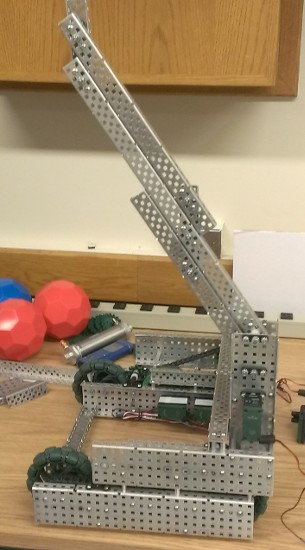

# Six Bar

The six bar lift is a derivative of the [four bar lift](four-bar.md). It utilizes the same geometry of four parallel bars, but in two stages. This split into two stages allows the lift to maintain a lower profile on the robot and condense into a smaller space, which then allows for a larger lift to fit within the 24" limits. This lift design has been used frequently in past Vex games, as the goal heights were typically high enough to be unreachable for a four bar, but just barely short enough for a six bar to reach. It is typically recommended that only the top of the two bars on the static end be driven by the motors, as there will be increased friction on the bottom arm as compared to the top. This can be alleviated by utilizing a PID control on the arm to ensure that one motor does not provide more force than the other on a given side, stressing the lift components and motors.

Because the lift arm is longer on a six bar than a four bar, more torque is required in order to lift the arm to its full height. The weight and length of the six bar lift also creates additional friction on the joint of the lift and the motors powering it. This can lead to more issues than would be encountered with a four bar lift such as burnt out motors or broken parts. The added length of the lift arm can create a greater tendency for the robot to tip forward when lifting or moving. Heavier loads will increase this chance of tipping. Despite these issues, the six bar lift is a very common lift system as well because it is relatively easy to build and maintain when compared to scissor lifts and reverse six bar lifts. Like the four bar lift, the six bar lift keeps the lifted end at the same angle throughout a lift or decent. This keeps game objects from falling out of the lift.

## Resources

[http://www.aura.org.nz/archives/672](http://www.aura.org.nz/archives/672)

